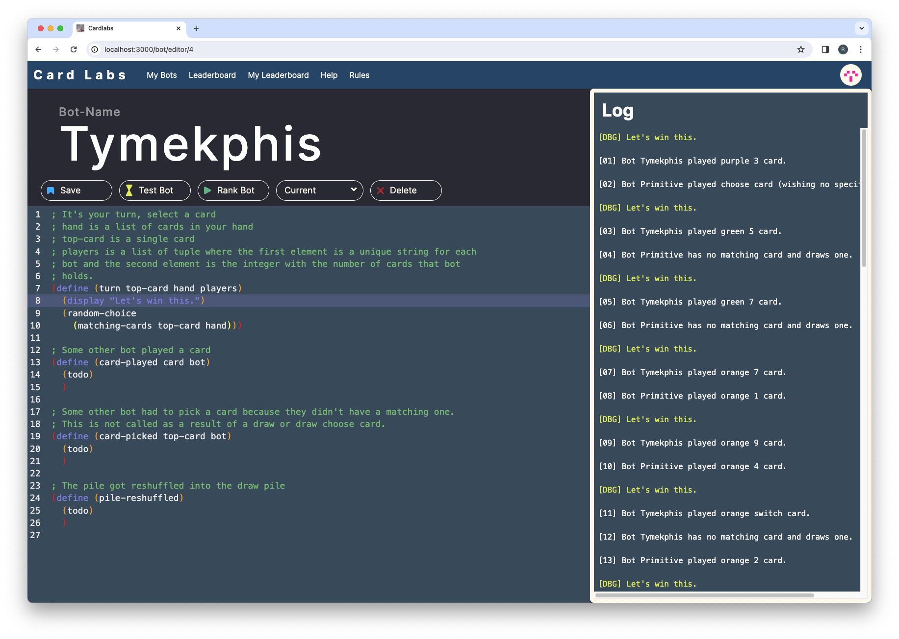

# CardLabs



A platform to write the best card playing bots.

## Run with docker compose

```bash
docker compose up --build
```

The frontend will start on http://localhost:3000.

## Run locally 

If you want to run the services locally you will need a local rabbitmq instance.
The easiest way to get one up running is with:

```bash
docker run -it --rm --hostname my-rabbit --name some-rabbit -p 5672:5672 -p 15672:15672 rabbitmq:3-management
```

Next you can start all the servers, each in their own terminal session:
```bash
# Start the management
cd management
gradle bootRun --args='--spring.profiles.active=local'

# Start the gameserver
cd gameserver
./mvnw compile exec:java

# Start the frontend
cd frontend
npm run dev
```

The frontend will start on http://localhost:3000.

## Continuous deployment

The lecture provided us with an GitLab instance and resources on a kubernetes
cluster. Both are no longer available but if you want to check out the CI 
pipeline for GitLab and the deployment config, you can find them in 
`.gitlab-ci.yml` and `kubernetes.yaml` respectively.
